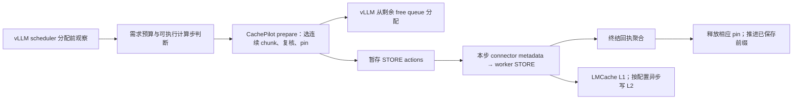

# 3C 接口约定：模型到真实推理栈

状态：2026-09-30，CPU 契约已实现，GPU scheduler/worker 尚未接入。参见 [当前模型与验证](experiments/2026-09-30/PROTECTION_STATE_MACHINE.md)、[分配前设计](experiments/2026-09-26/PREALLOCATION_DESIGN.md)。

## 各层职责

这是拟实施工作流。当前执行代码包括模型、独立CPU BlockPool/hash桥接和真实LMCache STORE metadata的CPU交接契约，不存在自动安装的scheduler扩展或真实RPC路径。

## 信息不能混用

| 信息 | 模型已有 | 真实接口要求 |
|---|---|---|
| 需求 | 外部传入真值 demand | 预测不得再次调用有副作用的 lookup；不得把所有 waiting 的完整 prompt 当本步需求 |
| 计算步 | scheduled_tokens > 0 | 分配前尚未完全确定本步可运行性；若 pin 后本步变成零 token，必须回滚 PREPARED，不可留下不会提交的 STORE |
| 物理身份 | block-id、快照 version、hash | 当前 vLLM 的 `block_hash` 是累计 block hash；需 group、完整 block 与缓存盐等语义，不能只检查 ID |
| chunk | 256-token、16 个 16-token block | LMCache chunk hash 与这 16 个不同的 vLLM hash 都不相同；必须校验 token 顺序与真实 hasher，不靠字符串相等 |
| free capacity | fake pool 或真实 BlockPool.get_num_free_blocks | 0 号 null block 不参与；共享 pin 引用不能按批次重复扣物理容量；运行请求引用需独立跟踪 |
| 回执 | 模型永不复用的 batch token | 当前 worker 按 request-id 计数，无 wire generation；跨代同 ID 单批在途，除非正式扩展协议 |
| 部分保存 | 连续 stored_prefix | 当前布尔 worker future 不携带部分成功前缀；不能伪造前缀确认或乐观跳过重存 |
| 完成 | receipt 后 unpin | 必须是所有相关 worker 不再读这些 GPU block 的终结证明；API 取消/timeout/进程失联不等于完成 |

## 分配与保护的原子范围

候选快照、hash 复核、pin 和接下来 allocator 的关系必须由同一个 scheduler owner 串行维护。不要在 `get_new_blocks()` 已选好 ret 后再 pin：那时 free queue 已经变化，会破坏 allocator 假设。CPU 桥接用真实 `touch`/`free_blocks` 验证 refcount，但只允许无外部引用的完整 cached block，不能直接混入运行 scheduler。

预算需要覆盖已有 pin、预计新增物理分配、保留余量及在途限制。预测偏小时 allocator 仍可能拒绝分配；这是需要回退或重新规划的反例。预测器本身尚未达到准入依据的门槛。保护预算为 0 必须退回原默认策略，不能改变请求序列。

## 提交与异常

1. `PREPARED` 只归 scheduler 所有。取消、零计算步、metadata 构建失败且确认未发送时，撤销 pin；不得误用此路径处理不明 dispatch 结果。
2. metadata 的 STORE action 交给 worker 后转 `SUBMITTED`。原 manager 后分配 drain 必须排除同批 action，避免重复提交。
3. completion 聚合完毕后，在 scheduler owner 释放该批 pin。失败不推进保存前缀，后缀重新决策；部分保存仅在真实协议能证明连续前缀时采用。
4. request-id 重用时，旧在途批次保留为 orphan，新代同 ID 的 STORE 阻塞；其他 ID 可以继续。需要取消新代候选而不是让旧回执更新它。
5. 模型 batch token 幂等不等于现有 wire 回执幂等。未来多 worker/重连/重复消息需带 server/client incarnation 和批次身份，或证明传输层聚合约束；不能只加一个本地计数器宣称解决。
6. 永久失联不按时间直接 unpin；只有 worker/engine 已停止访问资源的可验证终结、或整实例受控重建，才可释放。

## GPU 验证前置与验收

先完成 3B 尚未闭合的资源边界，保持现有默认策略。然后只在固定单 GPU、single-group full attention 的 Qwen3-4B 上，启用独立可回滚配置；与同版本、同 trace、同 KV 预算的默认/立即卸载/固定调优策略比较。

先验收逐块身份、pin/unpin、一次提交、取消/重用/失败/零步，继而比较真实 KV 内容与恢复输出，再移除逐步诊断日志计时。报告 TTFT P95、实际 prefill、D2H/H2D、排队、在途/保护峰值以及回退频率。保存块变多或丢弃块变少都不能单独代表收益。完整多 GPU、hybrid/sliding-window、生产故障容错不在首个 GPU adapter 的已支持范围。

## 2026-09-30 CPU交接验证增量

`cpu_store_metadata_bridge.py` 已与原生tracker的两个连续STORE范围逐字段匹配。它能验证metadata表示、computed token上界、交接前失败回滚和单worker终结的模型映射；不聚合真实worker回执，不修改现有LazyOffloadManager，也不解决同raw ID复用后旧wire回执重放。测试仅构造真实库CPU对象，不能作为GPU接入通过证据。
