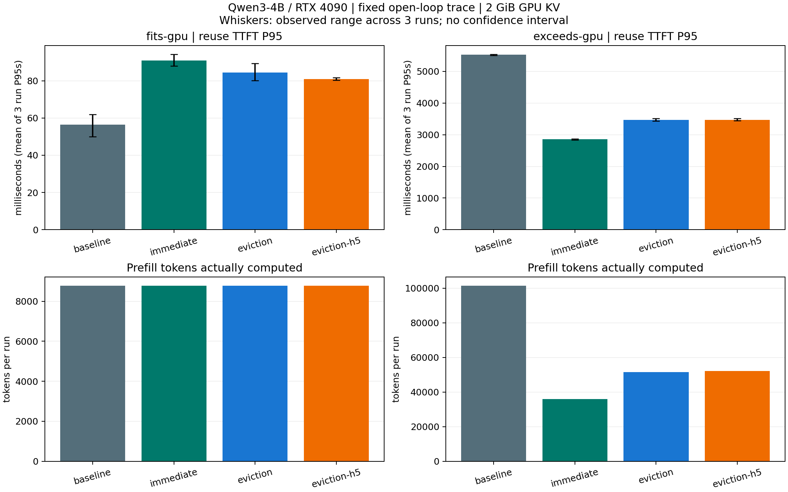

# CachePilot：第一轮可复现基线实验

日期：2026-09-24。状态：P2 初始实验；尚无 CachePilot 自定义策略。

本轮要回答：在同等 GPU KV 预算下，CPU 缓存何时有价值，现有延迟卸载是否留下值得改进的空间？24 个合成实验单元已经完成，每个配置重复 3 次，共 768 个测量请求，HTTP/SSE/输入输出预算检查均通过。**输出文本出现跨配置差异，正确性尚不能宣告通过；下面的性能数据是系统诊断证据，不能包装成已经验证正确的优化收益。**

## 1. 当前发现

- 工作集能留在 GPU 时，原生 vLLM 的复用轮 TTFT 更低。延迟卸载可以避免 CPU 写入，但 Connector 路径仍有开销。
- 工作集超过 GPU 时，立即卸载保留了更多可回载前缀，重算和排队更少；复用轮 P95 为约 2.85 秒，默认 EVICTION_AWARE 为约 3.47 秒，原生 vLLM 为约 5.53 秒。
- horizon 从 2.5 调到 5.0 没有改善压力负载的总体延迟。它只是两个固定参数点，不能称为完整调优或最优基线。
- 默认策略的最终计数包含每次 12 个 `dropped_evicted`。这提示“被选中保存前，块已经被淘汰”的路径值得追踪，但聚合计数还不足以证明某个新算法可以解决它。

## 2. 环境和公平性

| 项目 | 本轮设置 |
|---|---|
| 硬件 | RTX 4090 24GB，16 vCPU，约 92 GiB 主存 |
| 模型 | Qwen3-4B，BF16 权重与 KV，revision `1cfa9a7208912126459214e8b04321603b3df60c` |
| 软件 | Python 3.12.14，torch 2.13.0+cu130，vLLM 0.30.0，CUDA toolkit 13.0 |
| LMCache | 源码 commit `1a4b40b1d79b0e76244f127f96ee0982f8bd270f`；包标签 `0.5.5+g1a4b40b1d` 是本地构建标签 |
| KV 资源 | GPU 池固定 2 GiB，约 14.5K tokens；CPU L1 16 GiB |
| 服务 | max context 8192，max-num-seqs=4，torch.compile/CUDA Graph |
| 输出 | temperature=0，seed=42，ignore_eos=true，每请求 48 tokens |
| 隔离 | 每个实验单元重新启动 vLLM/LMCache；相同短 warmup 后重置 GPU prefix cache |

**2 GiB 是人为限制的 KV 池，不是 4090 只能提供 2 GiB KV。** 目的是用小成本制造可控的缓存压力；不能直接外推到使用全部可用显存的吞吐量。

四种策略：`baseline` 原生 vLLM 前缀缓存；`immediate` 不启用 lazy 的 LMCache 保存；`eviction` EVICTION_AWARE、horizon=2.5；`eviction-h5` horizon=5.0。两种 lazy 策略的 max_drain_per_step 均为 64。这里的“默认”指固定源码内该策略的默认参数，不是声称 LMCache 安装后默认启用 lazy。

资源、生成参数和回放 trace 在策略间保持一致，每次重复轮换策略顺序。各次运行在同一台租用容器内连续执行，没有锁定 GPU 时钟；三次重复不是跨机器统计。

完整配置见 [baseline-experiment.json](../../../configs/baseline-experiment.json)，软件包和硬件证据见 [环境验收](../../validation/2026-09-24/README.md)。

## 3. 回放究竟固定了什么

合成 workload 为 4/12 个 session，每个 4 轮。每轮完整输入由真实 tokenizer 计数并记录 SHA256，后续输入追加**预先录制的** assistant/tool 文本。本次生成的内容不会进入下一轮。初始材料预算 2048 tokens，含任务和历史后的实际输入略长。

轮次到达间隔 1800ms，会话间隔 20ms；主实验使用开放环。后续轮可能在前轮完成前到达，这是固定服务负载，不是因果执行的在线 Agent。封闭环工具另行支持“等待前轮结束＋think time”，两者不混为一组结果。

复用轮指 `turn > 0`，不保证每个请求实际命中。TTFT 是客户端发送请求到首个非空文本 SSE chunk；不把空 chunk 或一次 chunk 当成单个 token。另存 ready-to-first/end、客户端排队、会话完成时间与 token usage。固定输入和输出预算保证服务工作量口径一致，但输出不一致仍可能改变 decode 数值路径，因此不能忽略正确性差异。

## 4. 合成实验结果

表中是 **3 次运行各自 P95 的平均值**，括号为这三个 P95 的最小值–最大值。不是将所有请求混合求 P95，也不是置信区间。小工作集每次只有 12 个复用轮请求，压力工作集每次 36 个；尾延迟统计仅用于初步观察。

| 工作集 | 策略 | 复用轮 TTFT P95 / ms | 全请求 E2E P95 / ms |
|---|---|---:|---:|
| 留在 GPU | 原生 vLLM | 56.5（49.9–62.0） | 968.0 |
| 留在 GPU | 立即卸载 | 91.0（88.0–94.3） | 1039.1 |
| 留在 GPU | 默认延迟卸载 | 84.5（80.1–89.3） | 998.0 |
| 留在 GPU | horizon=5 | 81.0（80.4–81.6） | 994.0 |
| 超过 GPU | 原生 vLLM | 5529.3（5505.0–5543.2） | 6147.6 |
| 超过 GPU | 立即卸载 | 2853.8（2838.6–2863.5） | 3360.6 |
| 超过 GPU | 默认延迟卸载 | 3468.0（3437.5–3509.1） | 3998.0 |
| 超过 GPU | horizon=5 | 3468.6（3446.3–3512.2） | 4020.6 |



压力负载每次总输入 101400 tokens。以下取三次均值；小数 token 数来自重复间平均，不是单次出现小数 token。

| 策略 | 实际计算 prefill tokens | CPU 命中 tokens | 服务端平均排队 / ms | D2H / GiB | H2D / GiB |
|---|---:|---:|---:|---:|---:|
| 原生 vLLM | 101400 | 0 | 2611.8 | 0 | 0 |
| 立即卸载 | 35864 | 65536 | 1806.7 | 3.375 | 9.000 |
| 默认延迟卸载 | 51565.3 | 49834.7 | 2102.2 | 3.281 | 6.844 |
| horizon=5 | 52248 | 49152 | 2116.9 | 3.375 | 6.750 |

压力负载各组 GPU prefix hit 为 0，没有观察到 vLLM 抢占。CPU 缓存带来的主要可见变化是重算减少与排队缩短；这支持继续调查卸载时机。此处没有独立测出 DMA 关键路径占比，不能声称 PCIe 已饱和，不能简单把 queue/prefill/transfer 相加成延迟分解。

小工作集四种策略每次实际计算的 prefill 都是 8776 tokens，H2D=0。立即卸载仍写入 1.125 GiB；默认延迟卸载为 0；horizon=5 的三次为 0.28125/0/0 GiB。延迟卸载确实省去了部分无用写入，但整体延迟仍高于原生路径。

搬运量取 LMCache `transfer_phase_bytes_total` 的 **staging** 差分；kernel 和 staging 不能相加，否则会重复计数。计数窗口截至测量请求结束，未额外发送请求强制排空 pending；最终 lazy ledger 是随后停机时的快照，两者时间边界不同。

完整逐次指标、计数差分与输出比较见 [baselines-analysis.json](baselines-analysis.json)。

## 5. 输出正确性回归

主实验中，所有输入/输出 token 长度和流完整性检查通过，但文本 hash 不完全相同。对同次重复的原生 vLLM：小工作集各 LMCache 配置出现 1–2/16 不同，压力工作集为 7–11/48。JSON 中 baseline 的 0 是自比较，不是独立正确性证据。

串行专项设 max-num-seqs=1，每条请求前重置 GPU 缓存，比较原生完整 prefill 与 CPU prefix 回载，并保存 top-5 logprobs。初次因异步卸载仍占有块而 reset=false 中止；加入最多 20 次短请求推动完成回执、100ms 等待与 reset 成功检查后重新运行，未混用失败数据。

成功回归的 16 对请求中仍有 2 对不同（event 8/9）。各请求 GPU 命中为 0；CPU 组首轮未命中，其余每条命中 2048 tokens。两例首次分歧都在生成 token 索引 32，即第 33 个 token，候选是 `:` 与 `:\n`：event 8 的原生 top1/top2 logprob 差为 0.25，CPU 路径为 0.125 且排序反转；event 9 原生前两名同分，CPU 路径差 0.125。这支持继续检查计算路径的数值敏感性，不能单凭候选接近排除缓存问题，也不能归因于多请求并发。

进一步对两例单独运行原生 vLLM：先计算恰好 2048 tokens 的前缀，再发送原始完整输入，实测 GPU prefix hit=2048，与 CPU 回载长度相同。两例输出均与原生完整 prefill 一致、均与 CPU 组不同，见 [prefix-equivalence.json](prefix-equivalence.json)。这没有支持“仅仅因为少算了同样长度 prefill 就一定改变输出”的解释，但也未证明 CPU 缓存损坏：CPU KV 来源是较长的先前轮次，原生对照在恰好 2048 tokens 上计算，内核、原始 prefill 长度和浮点路径仍未完全控制。下一步应比较同一已计算 KV 经保存/回载前后的数值，而不是根据文本 hash 下结论。

详细证据见 [output-regression.json](output-regression.json) 与 [首分歧及 top-5](output-differences.json)。不能仅凭固定 seed 或 temperature=0 保证跨缓存路径逐 token 一致。主实验原生 vLLM 自身三次重复的全部文本一致，这与“所有跨配置路径均一致”是不同要求。

## 6. 真实结构轨迹边界验证

来源：[callanjfox/kv-cache-tester](https://github.com/callanjfox/kv-cache-tester)，commit `94f6046dfd9c0c8bc0cdb24a5aa6579bac8669bf`。仓库许可为 Apache-2.0；来源、筛选和文件 SHA256 见 [real-source-manifest.json](real-source-manifest.json)。

固定读取编号前 20 个文件：原始完整轨迹能放进 8K 的数量为 0。排除含嵌套子 Agent 的文件后，按 3–32 轮、长度 /8 后输入＋48≤8192 筛选，只得到 `trace_0019` 一个完整会话，24 轮，峰值原始输入 37356 tokens，缩比后 4669 tokens。

每个原始 64-token hash block 重建为确定性的 8 个 Qwen token ID；时间 /50、输出固定 48 tokens。保留会话内块身份和记录中的轮次，未恢复文本或执行工具。缩比改变了 chunk 对齐与绝对资源压力，只能称“匿名真实结构的缩比回放”，不能评价 Agent 任务成功率。这一个小会话也不足以复核真实压力场景。

四种配置各执行一次、每次 24 请求，共 96 请求，长度/流检查无错误，跨配置文本全部一致。结果如下，**只做边界验证，不作为三次重复主实验的一部分**：

| 策略 | 复用轮 TTFT P95 / ms | GPU 命中 tokens | CPU 命中 tokens | 实际计算 prefill tokens | D2H / GiB |
|---|---:|---:|---:|---:|---:|
| 原生 vLLM | 39.9 | 73632 | 0 | 4851 | 0 |
| 立即卸载 | 61.8 | 73632 | 0 | 4851 | 0.7734 |
| 默认延迟卸载 | 58.2 | 73632 | 0 | 4851 | 0 |
| horizon=5 | 59.5 | 73632 | 0 | 4851 | 0 |

所有 H2D 为 0。该会话保留了前缀复用，但没有造成 GPU KV 压力，因而仅复核“小工作集时 CPU 保存可能没有回载收益”。完整指标见 [real-analysis.json](real-analysis.json)。不能据此宣称默认策略的压力问题已经在真实负载复现。

## 7. 生命周期和稳定性

FIFO 专项：停止推理引擎后，GPU 注册与读写锁已经清空，但 active_sessions 仍为 1；600 秒仍为 1，630.16 秒观测到 0，符合 600 秒 TTL 加后台清理周期。见 [ttl-result.json](ttl-result.json) 和 [连续观测](ttl-observations.jsonl)。这只覆盖本次 FIFO 路径，不能替代取消、抢占、错误恢复和 EVICTION_AWARE 生命周期测试。

24 个合成实验中有 3 个在请求完成后的停机阶段记录 `AsyncLLM output_handler/EngineDeadError`。原生日志也出现该问题，因此不能直接认定由 LMCache 引起。现已使用父进程单次 SIGTERM 和 shutdown-timeout=10，避免给 EngineCore 重复转发信号；日志原样保留，不声称彻底解决所有停机问题。

## 8. 下一阶段的具体工作

1. **先解决正确性解释。** 根据串行回归缩小差异范围，比较原生 GPU 热命中、CPU 回载、相同已计算前缀，必要时增加 eager 对照与首分歧 token 的 logits。确认是可接受数值差异还是缓存路径缺陷后，再决定性能数据的采用范围。
2. **记录默认策略的决策过程。** 为 admitted→emitted/dropped 的候选记录 block/chunk 标识、预计淘汰距离、可用块与每步新分配量；把 dropped_evicted 对应到后续实际重算请求。先解释为何 horizon 加倍没有改善。
3. **补足固定参数与负载基线。** 扫描少量 horizon/drain 参数；加入封闭环、真实结构压力、CPU 容量不足场景，改变 GPU KV 大小核对阈值是否跟着变化。已有两点不能充当“充分调优过的基线”。
4. **再选一个小机制。** 若证据支持，优先试压力变化时提前提交卸载，或给高复用前缀分配搬运预算；保留低压力场景，避免用更多写入换取单场景优势。实现应复用 LMCache 的哈希、引用与完成回执安全机制。

尚未完成：50–200 会话规模、总缓存溢出、独立 DMA profiling、取消/抢占正确性、更大模型/硬件复核、完整在线 Agent 质量评估。P2 只完成初始实验，不整体标记完成。

## 9. 复现与证据

在已验证的 Conda 环境、项目根目录中，确认无其他服务占用 8000/5556/8081：

```bash
python -m unittest discover -s tests -v
python scripts/run_baselines.py --output artifacts/baselines-new
python scripts/summarize_baselines.py artifacts/baselines-new --output artifacts/baselines-new/analysis.json
python scripts/plot_baselines.py artifacts/baselines-new/analysis.json --output artifacts/baselines-new/plot.png
python scripts/check_outputs.py --trace artifacts/baselines-new/fits-gpu-trace.json --output artifacts/outputs-new
python scripts/check_prefix_equivalence.py --trace artifacts/baselines-new/fits-gpu-trace.json --regression artifacts/outputs-new --output artifacts/prefix-new
python scripts/prepare_real_trace.py --model models/Qwen3-4B --output artifacts/real-source-new
python scripts/run_baselines.py --trace artifacts/real-source-new/real-trace.json --output artifacts/real-new --repeats 1
```

输出目录要求尚不存在，防止覆盖实验。回放 schema、开放环/封闭环定义及指标口径见 [REPLAY.md](../../REPLAY.md)。8 项本地单元测试通过，覆盖分片 SSE、空块、流截断、封闭环依赖、客户端排队、哈希和 token-array 分叉校验；测试不依赖 GPU，也不替代模型输出回归。

原始日志、每请求数据、trace、真实来源样本与回归响应保存在服务器和本地 `artifacts/`。主实验/TTL/串行回归/来源样本已归档为 `baseline-evidence-2026-09-24.tar.gz`，约 2.1 MB，SHA256 见 [归档清单](baseline-evidence-manifest.json)，本地副本校验一致。真实小样本、相同前缀对照、重现脚本和驱动日志另归档为 `supplemental-evidence-2026-09-24.tar.gz`，SHA256 见 [补充清单](supplemental-evidence-manifest.json)。Git 保存脚本、配置、摘要和图表，不提交模型权重或大量原始输出。
