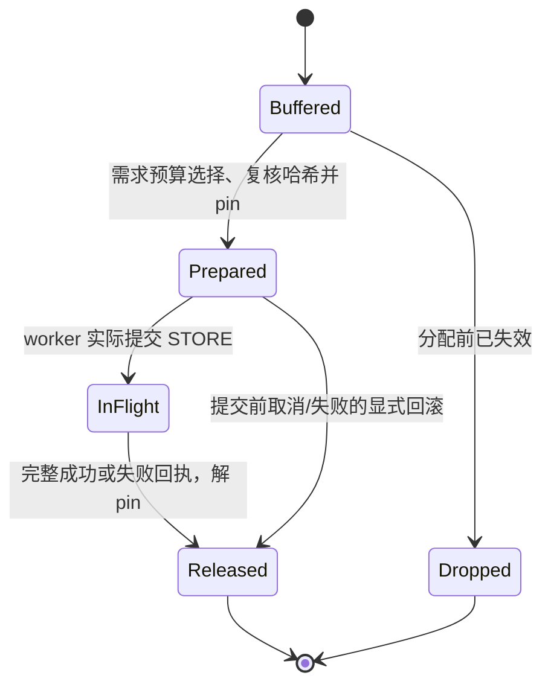

# 分配前需求预算：接入核查与实施边界

本文是实际分配信号实验之后的设计候选，**尚未实现为 GPU 策略，也没有性能收益结论**。是否实施取决于同轮消融结果。对应固定版本的源码片段及完整文件 SHA256 见 [allocation-signal-source-evidence.json](allocation-signal-source-evidence.json)。

同轮消融已结束：计数修正相对默认压力 P95 改善 2.82%，但仍比立即卸载高 19.37%，且 D2H 已接近立即卸载。因此决定继续推进本文 A 层的准入前需求观测；B 层保护/准入协调仍需 A 层证据与生命周期验收，不在本轮宣称完成。

## 为什么修正计数可能仍不足

实际顺序为：scheduler 为请求分配块 → 构造 connector metadata → manager 判断候选是否还有效、选择保存、pin → worker 收到 metadata → 提交 STORE → 后续回执解除 pin。

所以 `build_connector_meta` 收到再准确的分配数，也不能保护刚被前面分配覆盖的块。若要解决这个问题，必须让保存决定和保护发生在相关复用之前，并让 worker 真正执行保存。请求准入等待也必须算入客户端延迟。

## 已核实的接入点

| 位置 | 可获得的信息 | 限制 |
|---|---|---|
| Connector `on_new_request` | 请求到达、prompt 长度、请求 ID | 到达不等于马上准入；不知道最终 GPU 命中和本次物理分配数。 |
| scheduler `schedule` 开始、分配前 | waiting/running 队列、token budget、空闲块 | 当前 Connector API 没有通用的分配前决策钩子，需要小范围 scheduler 扩展。 |
| `get_num_new_matched_tokens` | 当前 GPU/外部命中 | 与准入很近，回调返回后同一步可能立即分配；不能当作已经提前留出一轮的通知。还要遵守异步 lookup 的锁及状态语义。 |
| manager 原有 drain | 候选、hash、在途批次、prefix closure | 发生在分配后。候选 block 被 pin 后会减少可分配容量。 |
| worker `wait_for_save` | 提交 STORE 的 metadata 与设备事件 | 保存是异步工作，提交不等于完成，不能随提交立即解除 pin。 |

本版本 `KVConnectorModelRunnerMixin.kv_connector_no_forward` 调用 `_get_kv_connector_output(..., wait_for_save=False)`；LMCache 的 STORE 提交在 `wait_for_save`。manager 因此明确跳过零 token step。**只删除这个 guard 并不构成可用的“空闲时保存”实现**：可能 pin 了候选、生成了 metadata，却没有走到对应 STORE 提交。

## 推荐分两层验证

先对本次修正信号的诊断账本做事后核查：11 个丢弃操作在首次实际复用之前，都出现过“导致分配的请求已经到达、候选已进入 pending、且不被在途 STORE 阻塞”的 token step。最早观测位置距离首次复用约 0.64–1.00 秒，最后位置约 7.9–104.6 毫秒。结果见 [preallocation-opportunities.json](preallocation-opportunities.json)，可用 `analyze_preallocation_opportunities.py` 从原始账本复算。

这说明本次负载存在更早观察等待需求的机会，但不是保存一定赶得上的证明：这是按事后已知的受害块筛选，不是在线预测；很多候选当时尚不在 free queue，且诊断日志本身会改变时间。仍需验证在线选择、保护对准入容量的影响，以及实际 DMA 完成时间。

### A. 先观测准入需求，不改变调度

用可单独加载的 scheduler 扩展，在分配前只记录已知的 waiting 请求与容量。仅支持当前单组 full-attention Qwen3-4B，明确 block size；初期不覆盖 hybrid/sliding-window/多 GPU。

按当前 token budget、可用并发槽和请求进度估计下一步新增块需求。prompt 总长只能作上界，不能将队列里所有远期请求的完整长度相加后都当作下一步压力。不要为预测重复调用带锁或改变状态的外部 lookup。首先检验预测是否比历史分配 EMA 更早覆盖真实突发，以及误报量。

日志需包含预测时间/步号、目标准入请求、估计范围、实际分配、距首次候选复用的时间、是否存在可执行 STORE 的步骤。离线“本来可以提前保存”不等于在线一定能完成 DMA。

### B. 若预测有足够提前量，再启用保护与准入协调

推荐先处理有模型计算步骤的情况：在准入前让 manager 根据需求预算挑选已完成、hash 有效的待保存候选，沿用前缀闭合与每请求单批在途规则，并先 pin；把生成的 STORE actions 暂存并并入同一步 connector metadata。随后 allocator 从剩余合法块中分配。worker 提交保存，回执后 manager 解 pin。

这需要给 manager 增加明确的“准备保存”入口，复用现有校验/保护流程，并保证同一步不能再次提交同一批。只在 allocator 的 `get_new_blocks` 回调里 pin 已选中的块，会破坏 allocator 对 free queue 和可分配容量的假设，不作为实现方案。

必须设置保护预算并维持前进性：若 pin 后没有足够块支撑合法计算，就暂不保护或回退现有策略，而不是无限期等待；若希望零 token 步也能保存，则必须同时增加并验证 worker 的无计算 STORE 执行路径、事件顺序、完成回执和调度唤醒。不能依赖人为发“Tick”请求作为正式系统机制。

## 状态约束与验收

这是拟增加的状态约束，不是声称上游已有完全相同的类或枚举。

- prepared actions 跨 scheduler/worker 边界恰好提交一次；提交失败有明确回滚，不能留下只有 pin 没有 future 的批次。
- 取消、抢占、请求 ID 重用时按 generation 区分；在途 STORE 对旧数据的读取结束前不能解除其保护，迟到回执不能作用于新请求。
- 每次选择保持完整前缀；重新读取 hash，与候选快照不符就丢弃，不保存已变更内容。
- 没有可运行请求、全部在等回载/保存、保护预算耗尽时仍能退出或前进；新增等待时间纳入 TTFT/会话完成时间。
- 先做确定性的 fake worker 状态机测试，再做小 GPU 保存/回载内容比较及资源回收测试，最后才进入关闭诊断日志的性能对比。

成功标准仍是实际 prefill 与延迟改善，且没有无效搬运、饥饿或资源泄漏。这个实现面比计数修正大；不能把预测命中率或减少的 dropped_evicted 单独写成最终收益。
