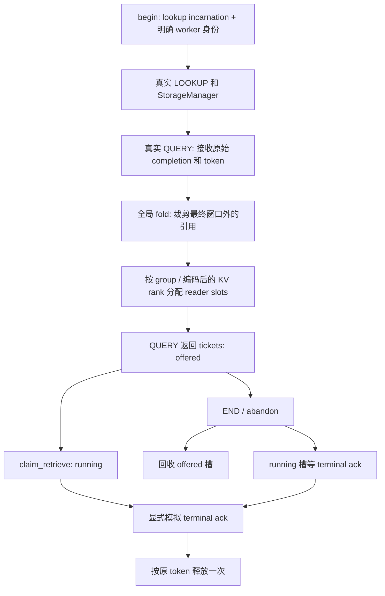

# Lookup 原始 token 与每 worker RETRIEVE 槽

状态：3B 所有权支线的独立 CPU 契约完成，**真实数据读取尚未实现，3B 未通过**。承接 [StorageManager 合并](OWNED_STORAGE.md)。没有启动模型、执行 GPU 实验或修改安装的 LMCache。

## 本轮解决什么

固定版 LookupModule 的 QUERY 消费 StorageManager bitmap，折叠为全模型命中长度，记录 session，再删除 native job。实际 RETRIEVE 按 key 取得对象，通过 stream callback 按 key/count 释放；原始 reader reservation 身份没有随结果交给 worker。本轮在实际 Lookup 方法外围验证一种显式身份接口，尚未替换上述服务路径。

`scripts/owned_lookup_contract.py` 执行真实 `LookupModule.lookup`、`query_prefetch_status`、`end_session`。Storage facade 接收上一轮的原始完成对象，先保存 token，再验证 handle、索引及逐 key reader 数。QUERY 只返回 worker ticket；原型 registry 继续持有 token，每个 ticket 只能领取一次，终结后释放对应的原始引用。



这里的 `finish_retrieve(succeeded=...)` 是测试提供的**模拟终结确认**。成功或失败都必须先确认消费者不会再使用资源，才能释放；本轮没有 CUDA event、DMA、worker future 或真实取消确认，因此不能用这个接口证明真实传输已停止。

## 关键行为

- Worker 由测试显式提供 incarnation 和逻辑 rank。同一 shard 的多个 reader 各取得独立 token；TP 两 rank 只领取自己的分片。原型采用本机 world/local rank 相同的 IPC 映射，未实现 MLA、跨节点拓扑或注册认证。
- 真实 IPC `ObjectKey.kv_rank` 经 `ComputeKVRank` 编码，不是简单的 worker 序号。本轮修正 owned StorageManager 的 PREFIX 校验，兼容既有纯数字 CPU fixture 和真实 IPC 编码，但拒绝混用。安装的上游 StorageManager 未修改。
- QUERY 对初始 L1 与 L2 合并结果重新执行真实全局 fold。一个滑窗 fixture 中初始 L1 保留 chunk 0，L2 延长前缀后最终只需要 chunk 2；原型释放 chunk 0 的原 token，再分配槽。固定版 native QUERY 没有消费 `_retain`；这只是 CPU fixture 发现的边界，未经过实际服务复现，不另判定为上游缺陷。
- offered 槽取消后可释放；running 槽取消只标记意图，等待明确终结。重复领取、重复终结、错误 worker/server 身份均拒绝；旧 generation 的回执不能释放新引用。
- 回调内 END 延后至当前作用域退出处理；晚注册 job 会被移除，pending controller 由调用方驱动完成后回收，不重新创建 session。保存最新 generation，避免旧 END 删除新一代的 session，即使新一代 job 已排空。
- 移交校验、通知或部分释放失败保留原 completion、未解决 token、终结状态及逐项结果。成功释放项移出集合，不自动重试，不将 unresolved job 计作完成。
- aux group、descriptor 拓扑不匹配、匿名 QUERY/wait/free、实际数据读取与 service shutdown 均拒绝。ticket 领取完整 retained shard；分段、分范围和多次 RETRIEVE 尚未支持。

## 验证

新增 **30 项 Lookup CPU 测试、9 个子测试**；另新增 1 项 StorageManager 混合 rank 格式拒绝测试。两文件组合 **60 passed、20 subtests passed**。

| 路径 | 结果及范围 |
|---|---|
| 真实 LOOKUP / QUERY | 命中长度、session 记录与原 token 集合对应；只返回一次 tickets |
| 共享 rank 两 readers / TP 两 ranks / 两 attention groups | token 精确分区，full attention 与滑窗保留范围正确 |
| END 在 QUERY 前后 / pending L2 | 未领取槽回收，已领取槽等模拟终结，pending 引用等 controller 完成 |
| QUERY/END、CLAIM/END 各 30 轮竞争 | 两种顺序均不丢引用；运行中的引用不因取消意图释放 |
| 双线程重复 terminal ack | 恰好一个成功，逐 token 只释放一次，job 完成计数一次 |
| 回调内取消/END、pending query 内 END | 当前作用域退出后处理；实际 native END 删除 session 一次 |
| 同 request-id 新旧代 / worker 重启身份 | 旧回执和旧 END 隔离；新 job 排空后仍不误删新 session |
| 空请求、早退、零命中 | 无 reader tickets，正常引用登记排空 |
| 消费后坏索引/重复 token/错误 handle/缺失 token | 拒绝交付，保留已收到证据；不凭 key 补造丢失 token |
| 下层错误、QUERY 通知异常、部分释放失败 | 错误向上可见，未解决引用保留，成功项不重试 |
| TTL 后新 reader | 旧终结释放返回 stale epoch，新 reader 不受影响；不证明旧 buffer 可读 |
| aux/拓扑不匹配、匿名 API、读取数据 | 不支持路径明确拒绝 |

完整服务器回归：**285 passed、46 subtests passed、117 warnings**。本地：**122 passed、163 skipped、26 subtests passed**。服务器设置 `CACHEPILOT_REQUIRE_RESERVATION_NATIVE=1`，强制执行 native/L1/controller/storage/lookup CPU 契约；本地没有 Linux 推理扩展，对应测试跳过。警告来自上游 telemetry/torch 弃用接口。

证据：[完整测试输出](owned-lookup-contract/full-pytest.txt)、[执行文件与依赖校验](owned-lookup-contract/evidence.json)。环境和独立 native 扩展沿用 [环境快照](../2026-09-30/environment-final.json)、[构建记录](../2026-09-30/reservation-native-contract/build.json)。StorageManager 本轮修改后的执行版本在新 manifest 中；旧报告和旧 hash 保留原实验事实。

```bash
export PATH=/usr/local/miniconda3/envs/cachepilot/bin:$PATH
CACHEPILOT_REQUIRE_RESERVATION_NATIVE=1 python -m pytest tests/test_owned_lookup_contract.py tests/test_owned_storage_contract.py -q
CACHEPILOT_REQUIRE_RESERVATION_NATIVE=1 python -m pytest -q
```

## 下一步与未覆盖边界

下一步设计并验证 token 有效性与 buffer lease：在 L1 元数据同步范围内校验当前 token、取得原对象 buffer、建立不可被 TTL/eviction 回收的活动读取引用；读取结束或实际传输终结后解除保护。必须验证校验后 TTL 到期、eviction、同 key 对象重建以及迟到完成等竞争。现有 C++ reservation lock 只有 acquire/release/reset 等接口，没有有效性查询或活动 buffer lease；不能把一次 token 校验当成完整内存保护。

本轮 allocator、event bus、L2 adapter、load plan、workers 和完成时间均由 fixture 提供；调用方驱动 `advance`，没有后台 reaper。running 槽无人确认时会保持可见；失败槽没有自动恢复。正常读取全部终结后 registry 会删除 job，之后 END 的完整 session 管理不属于这个原型。真实 wire、注册认证、lease、writer epoch、进程重启、永久不完成的 I/O、shutdown 和 actual RETRIEVE 尚未实现。

安装栈的无 END 死亡残留与 TTLLock 匿名释放反例仍未修复。3C CPU 契约可以继续研究，GPU 策略及性能消融仍等待 3B 资源门槛，不将上述 CPU 通过计为真实服务修复或性能收益。
