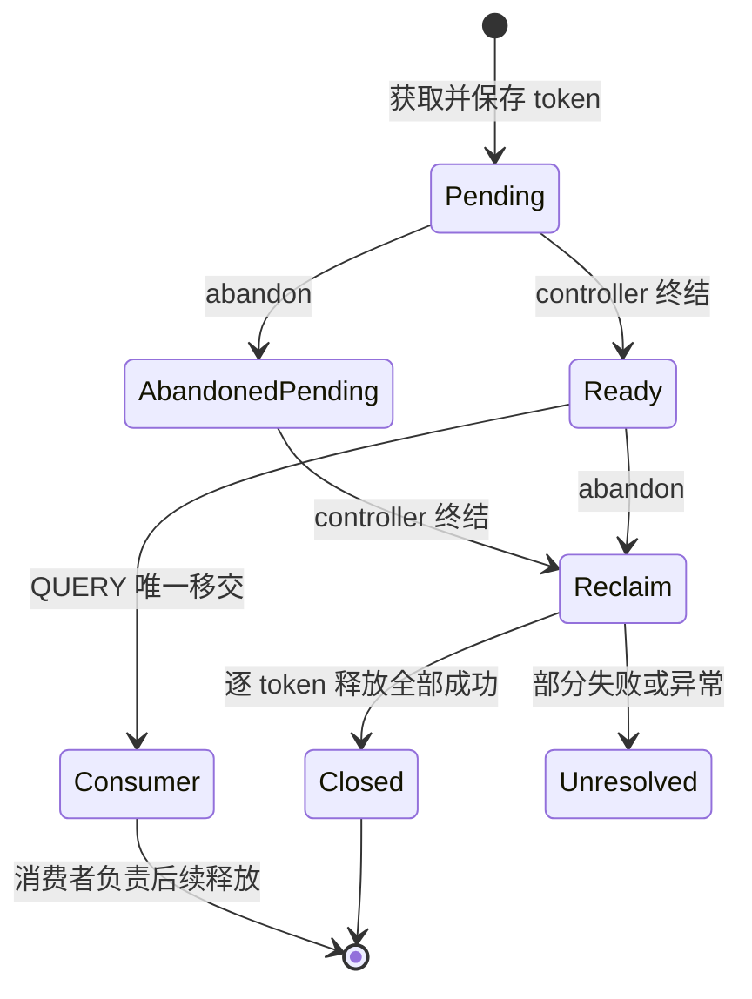

# Prefetch controller 的 token 流转与唯一移交

日期：2026-10-01（北京时间，接续9月30日晚的授权）。本轮将已实现的C++读引用token贯穿固定版真实PrefetchController的L1命中、L2写转读、裁剪、完成发布与破坏性消费方法。CPU契约中，QUERY移交与abandon回收只会有一方取得引用。**没有替换已安装LMCache，没有真实L2文件I/O、RPC或GPU实验，3B仍未完成。**

## 实现

`scripts/owned_prefetch_contract.py` 提供 `OwnedPrefetchHarness` 和受job作用域约束的L1适配器，运行以下未修改的上游方法：

- `_lock_l1_keys`：在真正reserve_read时捕获token，保留其原生prefix/sliding-window裁剪。
- `_poll_load_results`：消费adapter的完成bitmap；返回None时任务保持pending。
- `_finish_request`：运行真实的局部load结果映射、失败buffer删除、写转读、retained裁剪、WARM分支。
- `_complete_request` / `query_prefetch_result`：使用原有结果锁、条件变量、inflight计数和破坏性pop，存取扩展后的完成对象。

只在固定job作用域内将旧方法签名转为token操作。L1 reserve和写转读的返回值中捕获每个reader slot；裁剪只释放该job已捕获的token，禁止用完成bitmap到当前L1对象中补造身份。真实controller源文件SHA256固定为 `484609bd8146bcfdfacb35c41af9604bc0173d8434494cc9d016b15267e8b20e`。

完成对象 `OwnedCompletion` 保存不可变的job handle、retained位置和token元组。handle包含该harness实例的incarnation、单调job序号和外部request ID，同名request的新job不会覆盖旧job身份。发布前逐key验证token数量与retained集合及reader数一致；WARM完成不移交read token。

## 移交规则



`query_owned`和`abandon`共用所有权锁。QUERY取走结果后，job从回收方移除；迟到abandon不会释放消费者的token。abandon先到则禁止QUERY取走结果，直到controller终结才回收。重复QUERY/abandon不会产生第二个接收方。回调重入期间仅记录取消意图，不嵌套消费或重放当前操作。

部分释放成功、通知失败、写转读失败等情况保留未解决job、原完成对象（若已发布）、逐token结果和错误，不自动重试成功项。TTL后旧token不能释放新reader，但stale本身不证明临时对象已清理，因此仍保留unresolved，不增加成功回收计数。

这还不是客户端失联协议：测试直接调用abandon，未增加lease/death detector；完成后的消费者责任、进程重启、实际QUERY/RETRIEVE协议以及writer所有权尚未接入。

## 验证结果

新增 **19项CPU契约测试**：

| 范围 | 结果 |
|---|---|
| L1命中、2个reader/key | 完成结果保留获取时的原token，仅移交一次 |
| pending取消 | 原生poll返回None时保持引用；返回完成bitmap后才回收 |
| L1/L2混合与部分load失败 | 全局index 2有缺口，PREFIX只保留0、1；裁剪3、4的4个reader token，删除失败buffer |
| SPARSE、滑窗、WARM、空完成 | 非连续索引、窗口裁剪和零token分支符合真实controller语义 |
| QUERY/abandon竞争 | 50轮两线程竞争均只有一个接收方；另分别验证两种确定顺序 |
| request ID重用 | 旧job迟到完成只释放自己的token，新job引用仍在 |
| 错误incarnation、裸QUERY/裸释放 | 拒绝绕过job身份和作用域 |
| 部分释放失败、TTL旧引用 | 保留未解决状态，成功项不重试，新reader不被释放 |
| 获取通知失败、部分写转读失败、伪造bitmap | 保留已捕获token，禁止发布成功结果 |
| 回调重入、pending lookup、key顺序变化 | 不重复消费，不提前终结，不用改变后的key布局释放 |

完整服务器回归：**225 passed、26 subtests passed**；本地 **122 passed、103 skipped、26 subtests passed**。服务器通过 `CACHEPILOT_REQUIRE_RESERVATION_NATIVE=1` 强制要求已编译扩展，新增测试全部执行。本地跳过的是需要真实推理栈或Linux扩展的测试。

证据：[完整测试输出](owned-prefetch-contract/full-pytest.txt)、[源码和证据校验](owned-prefetch-contract/evidence.json)。运行环境沿用[9月30日快照](../2026-09-30/environment-final.json)，原生扩展沿用[构建记录](../2026-09-30/reservation-native-contract/build.json)。

```bash
export PATH=/usr/local/miniconda3/envs/cachepilot/bin:$PATH
python scripts/build_reservation_native.py  # 已构建且源码未变时不必重复
CACHEPILOT_REQUIRE_RESERVATION_NATIVE=1 python -m pytest tests/test_owned_prefetch_contract.py -q
CACHEPILOT_REQUIRE_RESERVATION_NATIVE=1 python -m pytest -q
```

## 实验边界与下一步

allocator、事件投递和L2 adapter用mock；load plan和write-reserved buffer由测试准备。原生controller的上述方法、native Bitmap、真实L1Manager获取/删除方法和本项目C++token锁实际执行；后台event-loop、load planner、真实I/O、StorageManager初始L1前缀路径不在本次覆盖中。成功消费token也不等于读数据时token一定仍有效，消费者的数据访问还需身份和内存生命期验证。

下一步将完成对象接到StorageManager的初始L1前缀和L2局部索引合并路径，处理纯L1的`prefetch_request_id=-1`也必须只移交一次；再对接LookupModule与RETRIEVE的每worker slot。保持失联lease、writer epoch、不可取消I/O及shutdown未解决项，不把CPU契约通过写成真实无END恢复通过。

00:07收尾检查：8000/8080/5555均无监听，GPU无计算进程、显存1MiB、利用率0%；服务器保持开机。

后续进展：StorageManager初始L1前缀、L2局部索引合并及纯L1一次消费的CPU契约已完成，见 [OWNED_STORAGE.md](OWNED_STORAGE.md)。上文225测试对应本轮历史结果；最新完整回归254通过，下一步转向LookupModule/RETRIEVE。真实服务仍未接入新token接口。
