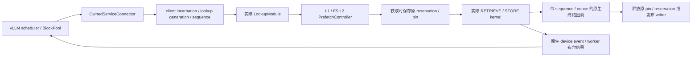

# 实际 MP 服务所有权接入与 3C 准入

环境：RTX 4090 24GB、Qwen3-4B、BF16、vLLM 0.30.0、CUDA 13.0，LMCache commit `1a4b40b1d79b0e76244f127f96ee0982f8bd270f`。本报告补充 [局部身份桥接](OWNED_MP_INTEGRATION.md)，不修改历史实验结论。

## 实现和责任边界

`owned_service.py` 是可选的固定版服务适配器，运行真实 LMCache constructor、L1 allocator、FS L2 adapter、后台 controller、RPC 和 native CUDA copy。不是先前独立 endpoint 或 CPU fixture。安装版源码保持不变；适配器启动前核对源文件 SHA256，拒绝未知版本。



- 读引用在获取点捕获 native `(lock_id, epoch, serial)` 并 pin，之后贯穿前缀裁剪、controller result、QUERY、RETRIEVE 和 L2 STORE。禁止按 key 事后补 token。TTL 使旧 reservation 过期，但不会解除活动 pin；旧引用只处置自己的 token。
- STORE writer 无 TTL，只有实际消费者终结后发布或删除失败对象。L2 listener 已弹出、controller 尚未提交的批次也计入关闭门槛；部分 partition 和不确定提交异常保留所有已获取引用及错误。
- 实际 CUDA stream 的 key-only completion 被版本化原身份 marker 替换。RPC 返回和设备 event 不单独触发 source buffer 释放；原 marker 与 host submit 返回都成立才终结 owner。worker 保留安装版设备 event/失败结果语义，scheduler 继续使用原 manager 的 GPU block pin 和回执处理。
- 客户端 incarnation 使用 PING 心跳；120 秒失联后放弃该客户端的 LOOKUP，等待实际 controller 完成再回收。END、过期和取消不能解除未终结的 CUDA owner。迟到/旧 sequence 拒绝；该保守规则可能让乱序的合法 LOOKUP miss，不能解释成吞吐优化。
- job 上限 256、client/tombstone 上限 1024，达到上限拒绝新增，不驱逐 tombstone 后重新接受旧身份。完整实例重启是清空失联元数据和 unresolved 状态的恢复边界。
- shutdown 先封住新工作并等待 job、controller、transfer、store batch、deferred context 和错误状态闭合，再允许 allocator/controller close。无法证明消费者停止时拒绝关闭，不能通过超时强行 unlock/free。

这是一套研究用 opt-in 适配器，不是已经可维护的上游最小补丁，也不提供生产级自动恢复。支持 TP=1、one-reader、单 full-attention group、零起点 PREFIX LOOKUP；不覆盖 hybrid/sliding-window、多 worker、动态 L2 或任意管理接口。

多 chunk 的 lazy STORE 另需保留获取时的身份：固定版 `_coalesce_store_metadata` 在合并时新建 metadata，遗漏 `request_configs`。第一轮自然抢占因此得到 `Invalid owned service identity` 和 HTTP 500。适配器对原 manager 文件做 hash 校验，在 opt-in 进程内包装该函数；合并前校验每块的 wire identity、configs 和 salt 相同，再复制原 configs。禁止根据当前 tracker 重建旧批次身份；六项协议测试覆盖跨身份/跨 salt/配置不一致拒绝与原配置不变。这是新增 wire 协议接入暴露的兼容问题，不能当作未修改 LMCache 原生路径必然失败的证据。

## 验证方法

`owned_service_matrix.py` 依次运行八个真实服务场景，每个场景自行启动和停止服务，固定输入与资源。正常回载另用 `validate_environment.py`，自然抢占另用 `natural_preemption_smoke.py`。故障模式只用于诊断，不能启用在性能回放中。

`audit_owned_service.py` 读取关闭后的完整 JSONL：按原 token 核对获取/释放恰好一次、job 注册/回收、实际 CUDA terminal 先于 RETRIEVE source 释放、提交/终结/退役一一对应及最终 BlockPool。只看 909 free 或锁计数归零不够；缺回调、提前 unpin 和重复释放的负例测试都必须失败。被杀死的客户端进程和预期 unresolved 负例需要单独审计，不能伪装为正常 drain。

## 失败轮保留

`matrix-r1` 的八个场景中六个通过，两个在审计阶段失败，原结果保留。文件短读实际获取 16 个原 token，裁剪 8 个非前缀对象，保留 8 个，最终 16 个全部释放一次；旧断言把获取数当成保留数。取消 STORE 时实际有 3 个在途传输；旧断言要求总数恰好为 1。修正后按注入的 `(request_id, sequence)` 检查终结是否仍未发生，不能凭总数判断窗口覆盖。

`matrix-r2` 七个场景通过，取消 STORE 的检查时刻原传输已经终结，覆盖断言失败。copy 前的 CUDA sleep 可能被 native 调用内部的 host registration/staging 同步消耗；该轮不计为取消在途覆盖。后续诊断在真实 copy 提交后插入 stream hold，延迟原 terminal 与设备 event，按原 transfer 身份验证取消先于 terminal。它验证的是终结确认在途时的资源保留，不证明取消或抢占发生在硬件 copy 执行瞬间。

自然抢占 r2/r3 请求和资源闭合，但同请求的自然抢占均未落入指定原生终结窗口，专项失败。r4 的 512 MiB KV 预算不足以启动 4096-token 最大上下文，属于实验配置失败；r5 降为 2048 最大上下文后四个请求完成，但只产生两个受控 STORE，未达到预设三批覆盖，仍为专项失败。后续用 EVICTION_AWARE 已有的 50ms 卸载期限使运行请求提交 STORE，再施加容量压力；配置和 stream hold 都必须在结果中标明，不能称默认性能实验。

r6 使用 30 秒回执观测延迟，四个请求完成且 GPU pin 最终解除，但运行期 drain 超时，停止引擎后仍有两个空 LOOKUP owner；没有 controller、transfer、读写锁或活动读 pin，服务关闭时才回收这两个 job。固定 manager 的零 token 步不执行 drain，pending suffix 可以阻止 END，与现象相容，但尚未唯一确定根因。该轮保持 `passed=false`，没有完成其后续 KV 专项；不据此断言 KV 损坏，也不以关闭时回收代替运行期验收。5 秒延迟的成功轮不证明这个问题已修复。

r7 改为 5 秒延迟，生命周期和资源检查通过，但 KV 分析器把同一 JSONL 中的 `worker_layout` 当 chunk 解析，得到 `KeyError('token_prefix_sha256')`，保持原失败结果。修复仅排除已知 layout 记录，未知 phase 或真实 chunk 缺字段仍拒绝；新增两项测试覆盖这些边界。r8/r9 是修复后重新运行的完整实验，不是重写 r7 的结果。

## 最终证据与阶段决定

八个服务场景在 matrix-r2 七项通过、focused matrix-r3 补齐两项取消实验后覆盖完成，不能说某个八场景矩阵单轮全通过。明细和证据入口见 [当前验收矩阵](VALIDATION_MATRIX.md)。

| 检查 | 最终结果 | 范围 |
| --- | --- | --- |
| 最终快照 CUDA 完整回归 | 438 passed、115 subtests | 包含真实 CUDA 契约；133 条 warning 保留在日志 |
| 正常 eager 回载 normal-r3 | 外部命中 1536 tokens，冷/热/重启回载文本一致 | 18 个原 token 全部 RELEASED 一次；4 个 native terminal；两个引擎各恢复 909 free |
| 自然抢占 preemption-r8/r9 | 每轮 4 次抢占、4 个请求完成 | 每轮 2 次抢占在指定原 STORE 的 native terminal 等待窗口内 |
| 抢占后资源 | 每轮 512 个 pin 引用释放、3 个 orphan 回执 | 9 个回执全部交付；454 free 恢复；job/controller/transfer/read/write/pin/batch 清零，退出后 GPU 注册清空 |
| 抢占后 KV | 每轮 12 个完整回载 chunk、432/432 层 bitwise 相同 | 6 个来源明确的 orphan chunk 无中间 STORE；不证明并发 decode 文本等价 |
| 关闭后原所有权审计 | r8/r9 每轮 24 个原 token、13 个 terminal 闭合 | token 恰好处置一次，RETRIEVE 原 source 释放晚于其 terminal |
| 丢失 STORE/RETRIEVE terminal 负例 | 预期 unresolved 验收通过 | 分别保留 8 个 writer、17 个 reader/pin；拒绝 transfer.close 和整实例关闭，随后丢弃实验实例 |

**决定：允许开始受控 3C，完整生产门槛继续开放。** 固定 eager、TP=1、单 full-attention group 和独立实例，先接零保护预算 `ProtectionConnector`，再最多两个 chunk 的小预算验证。每轮核对实际 KV 和原所有权资源；发现残留或未知终结即停止该轮并完整实例重建，不强行 free，也不继续累计性能结果。

这是对原计划广泛前置门槛的明确缩限：永久 I/O 自动恢复、真实 driver fault、硬件传输中断、长期乱序和 r6 空闲收尾仍未完成。基础服务准入不能替代 3C 新增 pin/metadata/receipt 路径验收。该轮所有权工作独立于策略贡献，当前仍没有 GPU 保护策略或新的性能收益。

matrix-r2/r3 先于最后的多 chunk configs 兼容修补及 KV 解析修补；没有声称最终快照重新跑过整个矩阵。最后快照执行了完整 CUDA 回归、两轮自然抢占及正常回载复查。源码校验和、native build manifest、原始成功与失败结果均归档在 `owned-service-evidence/`；实验启动脚本在服务器转换为 LF，hash 记录的是实际远端执行文件。

## 复现

在固定 Conda 环境和已下载模型的服务器上执行，各 GPU 实验串行运行：

```bash
cd /root/CachePilot
export PATH=/usr/local/miniconda3/envs/cachepilot/bin:/usr/local/cuda-13.0/bin:$PATH
python scripts/build_reservation_native.py
CACHEPILOT_RUN_CUDA_CONTRACT=1 python -m pytest -q
python scripts/owned_service_matrix.py --output artifacts/owned-service-matrix-r2
python scripts/owned_service_matrix.py --cases cancel-store-stream cancel-retrieve-stream --output artifacts/owned-service-matrix-r3
python scripts/validate_environment.py --modes owned-service --eager --output artifacts/owned-service-normal-r3
python scripts/audit_owned_service.py artifacts/owned-service-normal-r3 --output artifacts/owned-service-normal-r3/ownership-audit.json
python scripts/natural_preemption_smoke.py --owned-service --early-store --kv-probe \
  --requests 4 --decode-tokens 1024 --receipt-delay 5 \
  --terminal-hold-cycles 40000000000 --output artifacts/owned-service-preemption-r8
python scripts/audit_owned_service.py artifacts/owned-service-preemption-r8 \
  --output artifacts/owned-service-preemption-r8/ownership-audit.json
# 用新的输出目录重复上一组命令，保留独立结果；r9 即为独立重复。
python scripts/owned_service_unresolved_smoke.py --kind store --output artifacts/owned-service-no-terminal-store-r1
python scripts/owned_service_unresolved_smoke.py --kind retrieve --output artifacts/owned-service-no-terminal-retrieve-r1
```

输出目录必须未存在，历史目录请勿覆盖。正常实验必须完整 drain；丢终结通知实验必须保留原 buffer 并拒绝关闭，之后丢弃其自有实例。原始 KV 文件不进入 Git，证据归档只保留小型结果、状态、JSONL 和验证日志。归档 `.log` 仅改名为 `.txt` 以进入版本管理，内容不改写。

## 尚未覆盖

- 真实 CUDA driver fault、literal DMA transaction 内的中断没有注入。最终诊断的 stream hold 在真实 copy 提交后、终结标记前；自然抢占与终结确认时间窗重叠不证明硬件 copy 执行重叠或传输被中断。
- 持有真实 FS load 超过 shutdown budget 能验证拒绝关闭；不能证明内核 I/O 永久阻塞后可自动恢复。恢复依靠完整实例重建。
- 原生 reset API 的异步时序限制、compile-only 输出差异根因、多 GPU 和生产故障恢复继续单列。eager 的受控输出一致和 whole-chunk bitwise 比较不能扩大成所有并发 decode 输出等价。
- 3C 自己新增的 pin、metadata 和回执路径仍必须做正确性验收；基础服务通过不替代策略验收，不代表性能收益。
