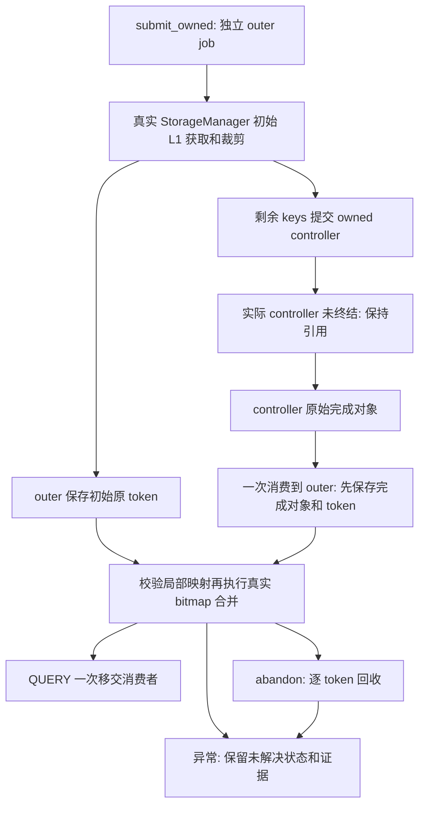

# StorageManager 原始 token 合并与一次移交

状态：3B 所有权支线的独立 CPU 契约完成，**未接入实际服务，3B 未通过**。承接 [controller 唯一移交](OWNED_PREFETCH.md)，本轮没有启动模型、执行 GPU 实验或修改已安装的 LMCache。

## 解决的边界

StorageManager 在提交 controller 之前已对原 keys 获取 L1 read locks。仅改 controller 不能保护这部分引用。PREFIX 会裁剪初始 L1 命中，再向 controller 提交后缀；SPARSE 提交不连续的 L1 misses。最终结果必须同时携带初始 L1 token 和 controller 原始 token，不能从合并后的 bitmap 或当前同名对象补造身份。

纯 L1 的原生 `prefetch_request_id=-1` 不代表独立 job，原生 `query_prefetch_status` 可以重复返回同一 bitmap。本原型为所有提交分配进程内 server UUID + 单调序号，纯 L1 也只能移交一次。这是原型所需的新语义，不把原生可重复状态查询单独判定为上游缺陷。

## 实现与工作流

`scripts/owned_storage_contract.py` 执行固定源码的真实 `StorageManager.submit_prefetch_task`、`_submit_prefix_fold`、`_combine_found` 和 `query_prefetch_status`。沿用 controller/L1 CPU fixture 和 C++ reservation lock；作用域 facade 仅在已知 outer job 内翻译原生调用。



控制原则：

- 初始获取就保存 token，PREFIX 裁剪只释放捕获的引用；后缀中同一 key 再命中时使用新 token。
- 先验证原始 key 数量、初始 retained set、controller 身份以及 local→original 映射；重复、越界、乱序和 L1/L2 重叠映射均拒绝。原生 Bitmap 静默丢弃越界位置不能算合并成功。
- controller QUERY 为破坏性消费：outer 先保存收到的完成对象和全部 token，再校验局部索引及逐 key reader 数。合并异常后，已接收的引用仍有 owner，不重查下层补造 token。
- QUERY/abandon 共用 outer 所有权锁。pending abandon 禁止消费，但保持初始 L1 引用直到 controller 终结，由 outer 统一接收并回收；不会独立 abandon child 后再尝试合并其结果。CPU fixture 由调用方驱动 `advance`，尚无后台 reaper。
- 获取通知失败、提交下层后异常、部分释放成功、TTL stale 等路径保留错误和原始证据；不自动重试，不增加成功回收计数。已成功释放的 token 从持有集合移除，避免后续重复减引用。
- PREFIX 只支持完整 chunk/group/rank 行；提交前拒绝不支持的 SEGMENTED_PREFIX、重复 keys 和无效 reader 数。调用者的可变 key 列表与 attention descriptor 在提交时复制。

下层 controller 是 outer 的专用结果来源；外部提前消费 child 会被判为 unresolved，而非永久伪装成 pending。本原型的锁保护 outer QUERY/abandon，并不构成实际服务后台线程的完整锁顺序设计。

## 验证

新增 **29 项 CPU 契约测试、11 个子测试**，包含 50 轮双线程 QUERY/abandon 竞争：

| 路径 | 验证结果 |
|---|---|
| 纯 L1 / `-1` / 同名请求 | 原始 token 只移交一次，不同 job 不共用引用 |
| PREFIX 混合 L1/L2、2 readers/key | 初始与下层 token 集合准确合并，临时对象最终删除 |
| SPARSE 部分 load 成功 | `(1,3)` 局部映射还原为原 key 索引，失败 buffer 清理 |
| 初始 gap 后缀再命中 | 初始裁剪的旧 token 不进入最终结果，后缀保留新 token |
| 滑窗、2 groups × 2 ranks | 原生 fold 按完整前缀和各组窗口保留原始位置 |
| WARM / skip L2 / 空请求 / 无 adapter | 零 reader token 分支及一次消费通过 |
| pending abandon、两种确定顺序、竞争 | controller 终结前不释放初始引用，终结后只有一个接收方 |
| 错误映射、局部完成越界、合并异常 | 合并前或移交后拒绝成功，引用和完成证据保留 |
| 获取/事件通知异常、提交后异常、child 错误 | 不丢已获取引用，不宣称回收完成 |
| 部分释放失败、TTL stale、回调重入 | 成功项不重试，不释放新 reader，不重复消费 |
| 外部提前取走 child、调用者修改 key 列表 | 外部消费错误可见，原始提交布局不受调用者列表修改影响 |

完整服务器回归：**254 passed、37 subtests passed、117 warnings**。本地：**122 passed、132 skipped、26 subtests passed**。服务器用 `CACHEPILOT_REQUIRE_RESERVATION_NATIVE=1` 强制执行 native/L1/controller/storage 契约；本地跳过需要 Linux 扩展或实际推理栈的测试。警告来自上游 telemetry/torch 弃用接口。

证据：[完整测试输出](owned-storage-contract/full-pytest.txt)、[源码与结果校验](owned-storage-contract/evidence.json)。环境及 native 扩展沿用 [9月30日快照](../2026-09-30/environment-final.json)、[构建记录](../2026-09-30/reservation-native-contract/build.json)。

```bash
export PATH=/usr/local/miniconda3/envs/cachepilot/bin:$PATH
CACHEPILOT_REQUIRE_RESERVATION_NATIVE=1 python -m pytest tests/test_owned_storage_contract.py -q
CACHEPILOT_REQUIRE_RESERVATION_NATIVE=1 python -m pytest -q
```

## 下一步与限制

下一步对接真实 LookupModule 的结果接收与 RETRIEVE 的每 worker reader slot：保持原 token，逐 slot 唯一移交，失败/取消只回收未移交引用。还需验证数据访问时 token 当前有效以及对象内存生命期；本轮只保证引用来源和移交，QUERY 返回旧 token 不等于它仍可安全读取。

allocator、event sink、L2 adapter、load plan 和完成时序由测试提供。后台 loop、原生 submit queue、真实 L2 I/O、RPC、消费者读数据、失联 lease、writer epoch、进程重启和 shutdown 尚未接入。job UUID/lock ID 都只有本进程身份语义；没有为实际 wire/restart 承诺身份协议。错误 job 在本原型中保持可见，也不等于已实现恢复或最终回收。

安装栈仍保留原生 TTLLock 缺口和无 END 死亡残留问题；这些 CPU 结果不能替代真实服务复测，不能作为 3C GPU 策略或性能收益证据。

## 后续接入记录

同日完成 [Lookup/worker reader slot CPU契约](OWNED_LOOKUP.md)。实际IPC生成的`kv_rank`是编码后的拓扑值；本轮Storage原型只用数字rank的PREFIX提交前检查不足以接收这些keys。后续版本已兼容整行的原生编码rank和原有CPU fixture，但拒绝混用，并补1项回归测试；旧报告的29测试和manifest仍对应原实验版本，修改后源码与完整285项回归记录在新报告。安装的LMCache未修改，实际数据访问和服务接入仍待完成。
